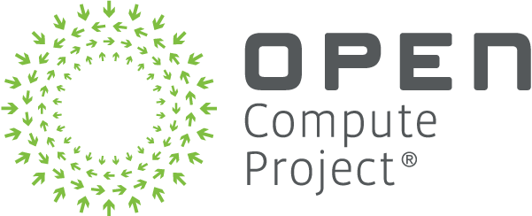
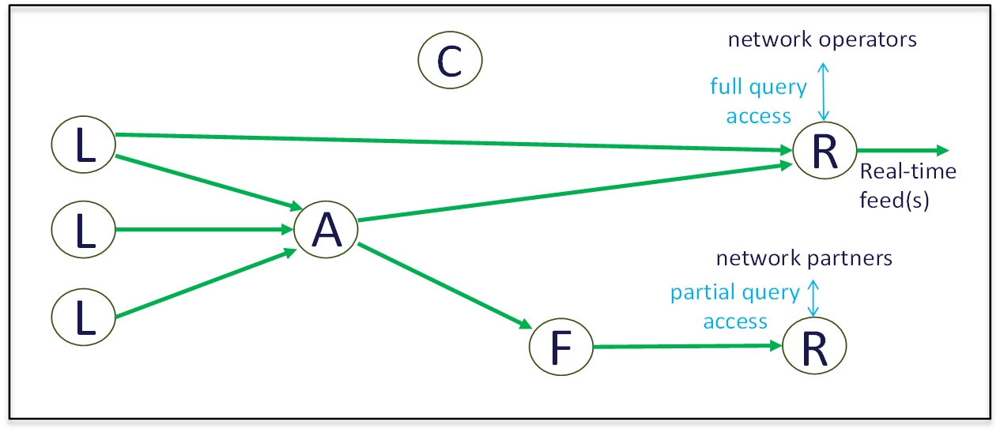
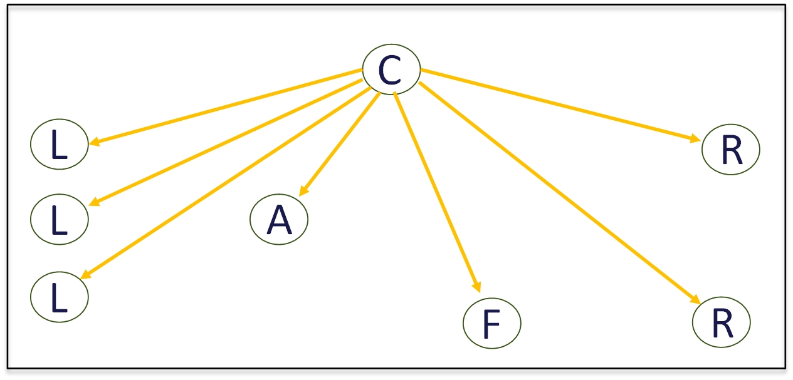

---
geometry: margin=2cm
numbersections: true
output: pdf_document
---

# Streaming Telemetry: Base Architecture

Revision: 

Date:

---

# Version Table
| **Date** | **Revision** | **Author** | **Notes** |
| :---     | :---         | :---       | :---      |
| WIP      | WIP          | Jim Harford | Under HEAVY construction |

---

# Table of Contents
- [Introduction and Overview](#introduction-and-overview)
- [Top-Level Architecture](#top-level-architecture)
- [Flows Among Nodes](#flows-among-nodes)
  - [Basic Flows](#basic-flows)
    - [Pushing Metrics](#pushing-metrics)
    - [Pulling Metrics](#pulling-metrics)
  - [Additional Flows](#additional-flows)
    - [Bootstrapping](#bootstrapping)
    - [Negotiating Stream Parameters](#negotiating-stream-parameters)
    - [Changing Stream Parameters](#changing-stream-parameters)
    - [Aggregating Metrics](#aggregating-metrics)
    - [Filtering Metrics](#filtering-metrics)
    - [Reporting Metrics](#reporting-metrics)
    - [Storing Metrics](#storing-metrics)
- [Node Details](#node-details)
- [Message Details](#message-details)

# Introduction and Overview
JJH: write some text

# Top-Level Architecture

The system is composed of logical building blocks, called nodes in this architecture.  There are 
five types of nodes, which cooperate to convey telemetry information from original data sources 
across the data center network to the ultimate consumers of that information.

*	A Leaf Node contains meters, which observe various aspects of interest, and then emits those 
observations across the data center network.  For example, aspects of interest could include 
temperature, power consumption, number of bytes transmitted, number of packet receive errors, 
CPU idleness; all kinds of metrics needed to properly manage data center equipment.

*	An Aggregation Node is an intermediate node that aggregates multiple telemetry streams received 
into a smaller number of output telemetry streams.

*	A Filtering Node is an intermediate node that removes certain information from telemetry streams, 
to prevent sensitive information from propagating.

*	A Reporting Node is an endpoint that stores and reports telemetry information of interest to 
authorized personnel and systems.

*	A Control Node coordinates the flow of telemetry information from Leaf Nodes towards Reporting Nodes.

The two figures below illustrate how the different types of nodes cooperate to convey telemetry 
information across the data center network.  In these figures, a circle labeled "L" is a Leaf 
Node, "A" is an Aggregation Node, "F" is a Filtering Node, "R" is a Reporting Node, and "C" is 
a Control Node.  The green arrows illustrate the flow of telemetry data between the nodes, as 
data journeys through the network from Leaf Nodes towards Reporting Nodes in this very simple 
example topology.

<figure id=stream-data-paths>
    
    <figcaption>
Figure 1: Example of Telemetry Stream Data Paths
</figcaption>
</figure>

On the right side of [Figure 1](#stream-data-paths) there are 2 different Reporting Nodes, one for network 
operators, and the other for network partners.  These partners could be data center customers, 
equipment suppliers, or other organizations with which the data center has some business relationship.  
The network operators (at top right) have full access to the telemetry data, but network partners 
(at bottom right) likely have access restrictions to prevent them from viewing sensitive information.  
Network partners view telemetry data after it has passed through a Filtering Node, where such sensitive 
information is removed.

In the above figure, an Aggregation Node is combining some information from 3 different Leaf Nodes, 
resulting in a stream of information to a Reporting Node.  The Aggregation node is likely performing 
reduction operations on the data, such as computing the average, minimum, and/or maximum of some 
metric across the different Leaf Nodes.  In contrast, there is some telemetry data that flows 
directly from a Leaf Node to a Reporting Node, represented by the top green arrow.

Regarding the scaling of topology, the architecture places no restrictions on the arrangement of 
Aggregation Nodes and Filtering Nodes within the end-to-end path.  Both types of nodes are optional, 
and the order in which one or more of them might be encountered along the path is determined by 
data center architects.  In other words, there could be an arbitrarily complex hierarchy of 
aggregation and filtering nodes used to manage a large data center.

Note that telemetry data does not flow through the Control Node.  Instead, it's function is 
illustrated in the next figure.

<figure id=stream-control-paths>
    
    <figcaption>
Figure 2: Example of Telemetry Stream Control Paths
</figcaption>
</figure>

A Control Node is responsible to setup a stream of telemetry data between a sender and receiver of 
that data.  This includes discovery of other types of nodes, negotiation of stream parameters, 
starting stream data, stopping stream data, and eventual tear-down of the stream.

A stream is a dynamically specified set of meter observations that are periodically reported together.  
Each green arrow in [Figure 1](#stream-data-paths) represents a unique stream.  In [Figure 2](#stream-control-paths), the gold arrows represent 
communication between a Control Node and the other types of nodes, in order to dynamically setup streams.
In the narrow context of telemetry data, a stream is analogous the networking community's concept of 
the Data Plane, and the setup & teardown of those streams as the Control Plane.

# Flows Among Nodes

## Basic Flows

### Pushing Metrics

We first look at a push style of communication, where the sending node periodically determines that it 
is time to emit sensor data towards the receiving node.

<figure id=pushing-metrics>
    
    <figcaption>
Figure 3: Pushing Metrics
</figcaption>
</figure>

Before any metrics are transmitted, the Control Node negotiates stream parameters with both the receiver 
and sender.  Then the Control Node sends a "start" signal to both the receiver and sender.

After this, the sender can begin sending packets containing various metrics to the receiver.  
The selected metrics, their order, and the frequency of packets were specified in the stream setup 
procedures.  In addition, at any time the sender could convey notification of carefully defined events, 
which I will discuss later.

When the Control Node determines that a previously setup stream is no longer necessary, the Control 
Node sends a "stop" signal to both the sender and receiver, followed by a "tear-down" signal to both 
the sender and receiver.

### Pulling Metrics

We think that push frameworks are more efficient and scalable than pull frameworks; however, we 
recognize that some data center operators will continue to use pull-style for legacy reasons.  
With a pull style of communication, the receiving node periodically determines that it is time to 
request the sender to emit recent sensor data towards the receiving node.

<figure id=pulling-metrics>
    
    <figcaption>
Figure 4: Pulling Metrics
</figcaption>
</figure>

The setup and starting of streams in a pull framework is almost identical to its push-style counterpart.

After the stream is started, the receiver can begin soliciting metrics from the sender.  Just like push 
style, the selected metrics, their order, and the frequency of packets were specified in the stream setup 
procedures.  In addition, at any time the sender could convey notification of carefully defined events, 
just like in push style.  In this diagram, the dashed line for the send_metrics() message is the sender's 
response to the prior request_metrics() solicitation message from the receiver.

The stopping and tear-down of streams in a pull framework is identical to its push-style counterpart.

An important point to understand about these 2 message sequence diagrams is that the sender is not 
necessarily a Leaf Node.  Aggregation and Filtering nodes also act as a sender of telemetry data.  
Likewise, the receiver is not necessarily a Reporting Node.  Aggregation and Filtering nodes also act 
as a receiver of telemetry data.  Instead, think of the diagrams as representing a single hop within a 
multi-hop end-to-end information flow.  In our architecture, a stream spans a single hop.

## Additional Flows

### Bootstrapping

This section describes the message flows among nodes that are necessary to establish and maintain
communication channels between Control nodes and all other types of nodes defined by this architecture.
In this section, the term "initiating node" refers to all node types other than a Control node.
The message flows in this section are illustrated in Figure ???.

Communication among nodes begins with Leaf, Aggregation, Filtering, and Reporting nodes initiating
network connections to a Control node.
Depending on data center policies and implementation, such connections may be more or less secure.
If security is being employed, the initiating node sends a *secure_connect* request to a Control node.
Otherwise, the initiating node sends a *non_secure_connect* request to a Control node.  In both cases,
the Control node responds to the request in order to create a communications channel for future messages.

The Control node next attempts to discover the capabilities of the initiating node by sending a
*query_capabilities* request to the initiating node.
The response to the *query_capabilities* request will include information on the presence or non-presence
of various features, plus the valid ranges of configurable options for those features.

The Control node next attempts to configure the initiating node by sending a *configure_node* request
to the initiating node.
It is presumed that the features and configurable values provided within the *configure_node* request
will be accepted by the initating node, because the available features and configurable values had
previously been known to the Control node via the *query_capabilities* response.
One scenario in which the initiating node might reject a *configure_node* request is if a specific
capability requires resources (e.g. memory) that have already been allocated to other tasks within
the initiating node.

Periodically, the intiating node can optionally send a *heartbeat* message to a Control node.
If the Control node considers the connection channel between itself and the initiating node to be
operational, then the Control node responds with a *heartbeat_ack* message to the sender of the
previously received *heartbeat* message.

<figure id=bootstrapping>
    
    <figcaption>
Figure 5: Bootstrapping
</figcaption>
</figure>

### Negotiating Stream Parameters

This section describes the message flows among nodes that are necessary to establish a stream of
periodic metric reports, from a node that sends the metric reports (called the "sending node" or
"sender") to a node that receives the metric reports (called the "receiving node" or "receiver").
The message flows in this section are illustrated in Figure ???.

A Control node begins the establishment of a stream by sending a *setup_stream* request message to
the node that will receive the metric reports.
In most cases the request should succeed, because the Control node has previously discovered the
capabilities of the receiving node, as described in Section ???.

One scenario in which the receiving node might reject a *setup_stream* request is if a specific
capability requires resources (e.g. memory) that have already been allocated to previously
established streams at the receiving node.
A receiving node shall signal its rejection of a *setup_stream* request by sending a *reject* message
to the Control node.  The *reject* message should include a suggested set of stream parameters that
the receiving node is currently prepared to accept.

When a Control node's *setup_stream* request is rebuffed by the receiving node's *reject* message,
then the Control node can optionally attempt to send another *setup_stream* request to the receiving
node, but this new attempt could incorporate the stream parameters suggested by the receiving node
in the previous *reject* message response to the previous *setup_stream* request.

A receiving node shall signal its acceptance of a *setup_stream* request by sending an *accept* message
to the Control node.

A Control node continues establishment of a stream by sending a *setup_stream* request message to
the node that will send the metric reports.
In most cases the request should succeed, because the Control node has previously discovered the
capabilities of the sending node, as described in Section ???.

One scenario in which the sending node might reject a *setup_stream* request is if a specific
capability requires resources (e.g. memory) that have already been allocated to previously
established streams at the sending node.
A sending node shall signal its rejection of a *setup_stream* request by sending a *reject* message
to the Control node.  The *reject* message should include a suggested set of stream parameters that
the sending node is currently prepared to accept.

JJH: finish this section!

<figure id=negotiating-stream-parms>
    
    <figcaption>
Figure 6: Negotiating Stream Parameters
</figcaption>
</figure>

### Changing Stream Parameters

JJH: write some text

<figure id=changing-stream-parms>
    
    <figcaption>
Figure 7: Changing Stream Parameters
</figcaption>
</figure>

### Aggregating Metrics

JJH: write some text

<figure id=aggregating-metrics>
    
    <figcaption>
Figure 8: Aggregating Metrics
</figcaption>
</figure>

### Filtering Metrics

JJH: write some text

<figure id=filtering-metrics>
    
    <figcaption>
Figure 9: Filtering Metrics
</figcaption>
</figure>

### Storing Metrics

JJH: write some text

<figure id=storing-metrics>
    
    <figcaption>
Figure 10: Storing Metrics
</figcaption>
</figure>

# Node Details

# Message Details
